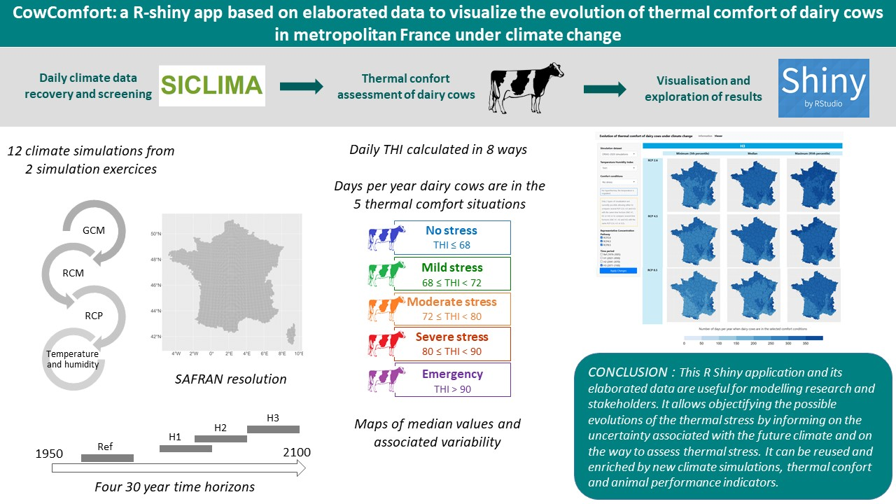

# CowComfort



## Objective and content

The main goal of this project is to assist researchers, stakeholders and policy makers in the spatialized visualization of the evolution of the thermal comfort of dairy cows under climate change.
It contains thermal stress indicators computed from French raw climate data from 2 climate simulation exercises, for different Representative Concentration Pathways (RCPs) and 30-year time horizons and for the whole of France at SAFRAN resolution.
It also contains associated maps and a shiny application we called CowComfort which allows you to compare maps for different indicator calculations, time horizons and RCPs.
It is based on the following tree structure:
```
.
├───data_csv : contains raw (non-public) climate data extracted in CSV format from the SICLIMA online application. These data are voluntarily not shared.
├───data_rds : contains raw (non-public) climate data converted in RDS format. These data are voluntarily not shared.
├───data_out : contains elaborated data (figures, maps) computed from raw climate data with the main.R file. These data are voluntarily not shared here but can be found on the repository recherche.data.gouv.fr (https://doi.org/10.15454/CVZX7Q)
│   └─── THI : daily THI values computed from raw daily average temperature and relative humidity.
│   └─── D1 : annual number of days dairy cows are in stress-free, mild stress, moderate stress, severe stress and emergency conditions.
│   └─── D2 : D1 aggregation according to three types of calculations (median, 5th percentile, 95th percentile) by simulation exercise, SAFRAN grid point, RCP and time horizon.
│   └─── D3 : maps at the scale of France drawed from D2 
├───shapefiles
│   ├───shapefile_departements_FR
│   │   └───DEPARTEMENT : shapefile of French departments
│   └───shapefile_SAFRAN : shapefile of the SAFRAN grid 
├───utils
│   - functions.R : contains functions called by the main.R script, in particular for calculating indicators.
│   - functions_and_htmlcode.R : contains functions called by the server.R script, in particular for displaying the contents of the two Rshiny application tabs.
└───www : contains maps equivalent to those in the D3 directory, but without legends. These are the maps used by the R-shiny application. They are voluntarily not shared (≈5Go) here but can be found on the repository recherche.data.gouv.fr (https://doi.org/10.15454/CVZX7Q). Contains also the css style in the style.css file.
- main.R : R code developed : 1) to calculate daily THI values from daily average temperature and relative humidity (THI directory) ; 2) to calculate the annual number of days dairy cows are in stress-free, mild stress, moderate stress, severe stress and emergency conditions (D1 directory) from THI ; 3) to aggregate D1 according to three types of calculations (median, 5th percentile, 95th percentile) by simulation exercise, SAFRAN grid point, RCP and horizon (D2 directory); 4) to draw maps at the scale of France from D2 (D3 directory). This script cannot be rerun in its entirety, as the raw climate data are not public and were not shared.
- server.R : R code developed to give the instructions allowing the calculations under R in order to create the outputs and update the results of the R shiny application according to the choices of the user
- ui.R : R code developed to define the R shiny application, i.e. the layout and appearance of the application.
- install_required_packages.R : R code to install the required R packages.

```
This project is also archived in a dataverse "Evolution of thermal comfort of dairy cows under climate change" on the repository recherche.data.gouv.fr, in the form of 2 datasets : 
•	one corresponding to the content of the data_out directory ; DOI: 10.15454/CVZX7Q; Direct URL: https://doi.org/10.15454/CVZX7Q
•	one corresponding to the Rshiny application only ; DOI: 10.15454/GFBDL6 ; Direct URL: https://doi.org/10.15454/GFBDL6

## Installation
To install R, follow the instructions given at https://cran.r-project.org/.
To install RStudio, follow the instructions given at https://posit.co/download/rstudio-desktop/.
To install the required R packages, run the install_required_packages.R R script.

## Usage

### Use the online R-shiny application
The application is freely available and has been deployed on the Shiny R Application Server (https://aigraux.shinyapps.io/CowComfort/)

### Use the application on your own pc
1) install the environment (see Installation).
2) download the following elements and tree structure from GitLab:
```
.
├───utils
│   - functions_and_htmlcode.R 
└───www
- server.R 
- ui.R :R
```
3) download the zipped maps from the [repository recherche.data.gouv.fr](https://doi.org/10.15454/GFBDL6) and unzip them in the www directory.
4) double-click on the server.R script to open it in Rstudio, then launch the application by clicking on the "Run App" button in the menu bar.
5) you can choose to open it in the browser by clicking on "Open in Brower" (optional).
6) read the "Information" tab then click on the "Viewer" tab to navigate through the data.
7) change the selection according to your choices and click on the "Apply Changes" button to apply them.

## Roadmap
This project can be enriched by new climate simulations and by other indicators of thermal comfort of dairy cows.
With new developments, this work could also be extended to estimate the impact of heat stress on the performance of these animals (ingestion, reproduction, milk production).

## Contributing
If you would like to contribute to the project, please send an e-mail to: anne-isabelle.graux@inrae.fr

## Authors and acknowledgment
Anne-Isabelle Graux anne-isabelle.graux@inrae.fr, 
Thomas Demarty Thomas.Demarty@insa-rennes.fr,
Philippe Faverdin Philippe.faverdin@inrae.fr (retired),
from PEGASE, INRAE, Institut Agro, 35590 Saint-Gilles, France

## License
The project is licensed under gpl-3 (see details in the LICENSE file).

## Funding
This work has received funding from European Union's Horizon 2020 research and innovation programme - GenTORE - under grant agreement N° 727213.

## Project status
Development is currently stopped (Last update : 06-09-2023).